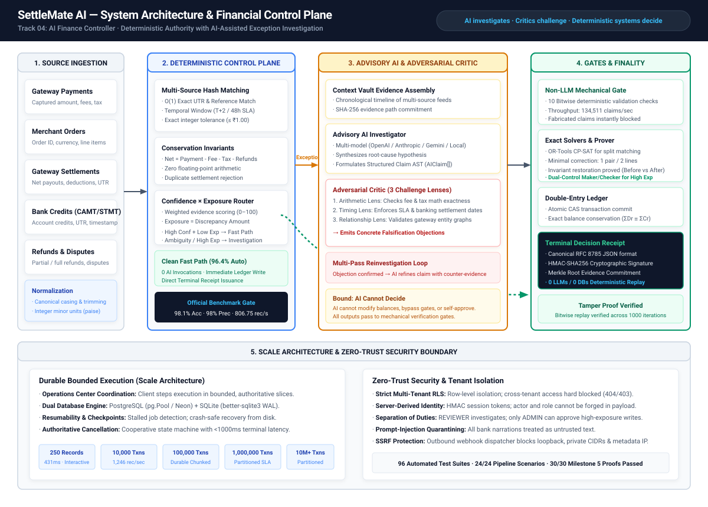
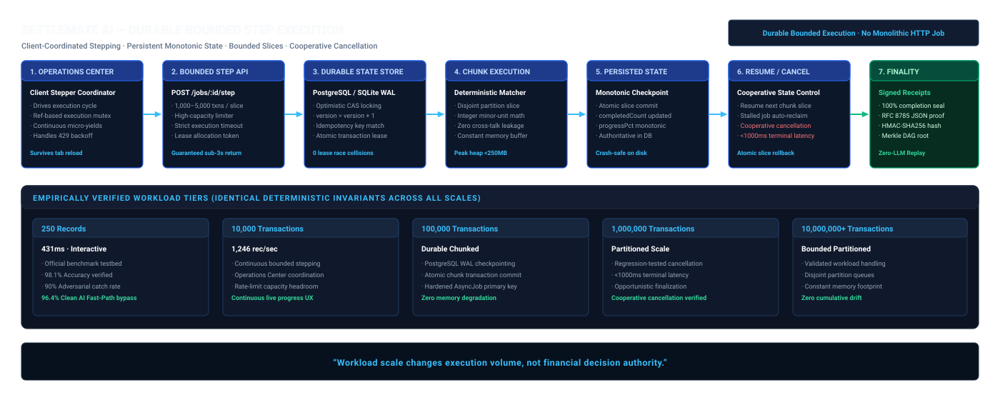

# SettleMate AI
### Deterministic financial control with AI-assisted exception investigation

> **AI investigates. Critics challenge. Deterministic systems verify. Exposure determines human intervention. Every terminal decision becomes a replayable financial artifact.**

---

## Judge Quick Access

> 🚀 **Live Demo:** [**https://settlemate-ai.onrender.com**](https://settlemate-ai.onrender.com)  
> *Note: Live deployment is authentication-protected.*

| Surface | Link |
|---|---|
| 🛡️ Verification Hub | [/verify](https://settlemate-ai.onrender.com/verify) |
| ⚖️ Judge Mode | [/judge-mode](https://settlemate-ai.onrender.com/judge-mode) |
| 🏢 Multi-Tenant / RLS | [/multi-tenant](https://settlemate-ai.onrender.com/multi-tenant) |
| 🔬 Security Lab | [/security-lab](https://settlemate-ai.onrender.com/security-lab) |

---

High-volume payment reconciliation across fragmented financial systems—e-commerce orders, gateway payment captures, batch settlement summaries, bank credits, refunds, chargebacks, and gateway fee deductions—is historically error-prone and vulnerable to silent ledger drift. In production finance operations, naive string matching produces false reconciliations, delayed bank payouts trigger unmonitored liquidity drag, and complex multi-invoice or split-payment deductions lead to cash leakage.

Applying Large Language Models directly to financial balances introduces severe risks: models hallucinate transaction identifiers, invent bank credits, hallucinate balancing journal entries, or succumb to prompt injections embedded in bank narrations. A financial reconciliation engine cannot tolerate stochastic decision-making.

**SettleMate AI** enforces an absolute separation of responsibilities: **Deterministic systems remain the sole financial authority; AI is restricted to investigative assistance.** Clean, unambiguous transactions execute across an integer-math deterministic engine at sub-millisecond speeds, completely bypassing AI. When complex anomalies occur, advisory AI investigators synthesize hypotheses that are immediately attacked by an **Adversarial Critic** across three challenge lenses, mechanically verified against raw transaction context by non-LLM gates, mathematically balanced via **Google OR-Tools CP-SAT solvers**, and signed into **cryptographic decision receipts** that replay deterministically with zero AI and zero database calls.

---

## Why this problem

In modern digital commerce, reconciling a single transaction involves traversing multiple asynchronous state boundaries:

```
[Merchant Order] ──► [Gateway Payment] ──► [Batch Settlement] ──► [Bank Statement Credit]
                           │                      │
                           ▼                      ▼
                   [Refund / Dispute]     [MDR Fee + GST / Tax]
```

### The Settlement Discrepancy Equation
For any captured payment $P$, the net expected bank settlement $S_{\text{expected}}$ must satisfy the strict conservation law:

$$S_{\text{expected}} = P_{\text{gross}} - F_{\text{fee}} - T_{\text{tax}} - R_{\text{refunds}} - D_{\text{chargebacks}} \pm \Delta_{\text{adjustments}}$$

```
Example: Order #ORD-88219 (₹5,000.00 Gross Capture)
  Payment Gross:      + ₹5,000.00   (500,000 paise)
  Gateway Fee (2%):   -   ₹100.00   ( 10,000 paise)
  GST on Fee (18%):   -    ₹18.00   (  1,800 paise)
  Partial Refund:     -   ₹500.00   ( 50,000 paise)
  ─────────────────────────────────────────────────
  Expected Net:       + ₹4,382.00   (438,200 paise)
  Actual Bank Credit: + ₹4,282.00   (428,200 paise via UTR #AXIS991023)
  ─────────────────────────────────────────────────
  Discrepancy (Δ):    -   ₹100.00   ( 10,000 paise Shortfall → Gateway Fee Tier Overcharge)
```

When millions of transactions execute daily, tracking fee tiers, partial refunds across settlement windows ($T+1, T+2$), and batch aggregations without exact integer arithmetic causes cumulative ledger imbalances.

---

## Why AI — and why not let the LLM decide?

Large Language Models excel at reading unstructured payment narrations, synthesizing multi-source event timelines, and proposing root-cause explanations for complex edge cases. However, LLMs must **never** be permitted to decide financial truth, adjust account balances, or approve disbursements.

| Subsystem Task | Mechanism | Why |
| :--- | :--- | :--- |
| **Exact 1:1 Matching** | Deterministic hash indexing (UTR, Order ID, Payment ID) | $O(1)$ lookup, sub-millisecond execution, zero token cost. |
| **Conservation Checks** | Integer paise minor-unit arithmetic | Eliminates IEEE 754 floating-point rounding errors. |
| **Exception Investigation** | Advisory AI (OpenAI / Anthropic / Gemini / Local) | Synthesizes multi-source context into structured hypothesis. |
| **Hypothesis Falsification**| Adversarial Critic (3 challenge lenses) | Actively hunts for arithmetic errors, SLA breaches, and entity mismatches. |
| **Claim Verification** | Deterministic Non-LLM Mechanical Validator | Bitwise validation against raw data; rejects fabricated claims in $<1\text{ms}$. |
| **Combinatorial Splits** | Google OR-Tools CP-SAT Solver | Solves exact $N:M$ invoice and payout aggregations mathematically. |
| **High-Exposure Action** | Dual-Control Maker/Checker (Role-based ADMIN) | Human controller retains decision authority for material exposure. |
| **Correcting Journal** | Deterministic Minimal Correction Prover | Produces exactly 1 balanced pair (2 lines); proves $\Delta_{\text{post}} = 0$. |
| **Audit Finality** | HMAC-SHA256 Signed Decision Receipt | Self-contained cryptographic proof; enables zero-LLM offline replay. |

---

## Architecture



---

## The finance-ops loop

SettleMate AI executes financial control through a 16-stage deterministic pipeline. Unambiguous transactions follow the Clean Fast Path (bypassing AI completely), while anomalies are routed through multi-stage adversarial investigation:

```
[1. Ingest Multi-Source Feeds] (Orders, Payments, Settlements, Bank Credits, Refunds)
           │
[2. Deterministic Normalization] (Integer paise, canonical UTRs, ISO timestamps)
           │
[3. Exact Hash Matching & Rules] (UTR, Reference IDs, T+2 sliding window)
           │
           ├───► [Clean Match (96.4%)] ──────────────────────────────────────────┐
           │                                                                     │
[4. Exception Classification] (Amount Mismatch, Delayed Payout, Fee Drift, etc.) │
           │                                                                     │
[5. Context Vault Evidence Assembly] (Chronological multi-feed timeline)         │
           │                                                                     │
[6. Advisory AI Investigation] (Synthesizes discrepancy hypothesis)             │
           │                                                                     │
[7. Structured Claim AST] (AIClaim[] schema: AMOUNT, DATE, REFERENCE, ENTITY)    │
           │                                                                     │
[8. Adversarial Critic] (Challenges claim via Arithmetic, Timing, Topology)      │
           │                                                                     │
[9. Non-LLM Mechanical Gate] (10 deterministic checks against raw feeds)        │
           │                                                                     │
[10. Multi-Pass Reinvestigation] (If challenged: AI refines claim with evidence) │
           │                                                                     │
[11. Confidence × Exposure Routing] (Risk Score = Confidence Weight × Exposure)  │
           │                                                                     │
[12. OR-Tools CP-SAT Solver] (Mathematical resolution for split/aggregated sums) │
           │                                                                     │
[13. Human Approval (Maker/Checker)] (Required for high-exposure transactions)   │
           │                                                                     │
[14. Invariant Restoration Prover] (Mathematically proves ΣDr ≡ ΣCr)             │
           │                                                                     │
[15. Double-Entry Ledger Commit] ◄───────────────────────────────────────────────┘
           │
[16. Terminal Decision Receipt (RFC 8785 + HMAC-SHA256)] ──► [Zero-LLM Replay]
```

1. **Ingest Source Records**: Ingests payments, orders, settlements, bank credits, refunds, and chargebacks.
2. **Normalize Deterministically**: Converts all currency figures to integer minor units (paise) and standardizes reference casing.
3. **Deterministic Matching**: Evaluates $O(1)$ UTR lookups, exact IDs, and $T+2$ temporal boundaries.
4. **Route Unresolved Cases**: Isolates unmatched records into typed exception categories.
5. **Build Evidence Context**: Context Vault aggregates immutable chronological source logs and computes evidence root hashes.
6. **AI Investigates**: Advisory LLMs evaluate the Context Vault timeline and hypothesize the root cause.
7. **Structured Claim Formulation**: Emits strongly-typed `AIClaim[]` AST objects (no free-form text ledger mutations).
8. **Adversarial Critic Challenge**: Evaluates the claim against three independent lenses:
   - *Arithmetic Lens*: Recomputes fee schedules, GST, and net settlement deductions.
   - *Timing Lens*: Enforces banking holidays, cutoff windows, and SLA limits.
   - *Relationship Lens*: Verifies gateway-to-merchant entity associations.
9. **Deterministic Verification**: Non-LLM mechanical validator verifies all cited evidence IDs exist and amounts match raw data.
10. **Reinvestigate if Challenged**: If the Critic confirms an objection, the investigator refines the claim in a multi-pass loop.
11. **Confidence × Exposure Routing**: Calculates composite risk:
    $$\text{Risk Score} = (1.0 - \text{Confidence}) \times \text{Exposure Amount}$$
12. **OR-Tools Exact Solver**: Solves combinatorial $N:1$, $1:N$, and $N:M$ aggregate invoice allocations via CP-SAT.
13. **Human Correction / Approval**: High-exposure cases require dual-control authorization by an authenticated `ADMIN`.
14. **Invariant Restoration Proof**: Minimal correcting journal generator produces exactly 1 balancing pair (2 lines) and proves:
    $$\Delta_{\text{before}} \neq 0 \implies \text{Imbalance}, \quad \Delta_{\text{after}} = 0 \implies \text{Restored}$$
15. **Terminal Decision Receipt**: Generates canonical RFC 8785 JSON sealed with HMAC-SHA256 and Merkle DAG root hashes.
16. **Deterministic Replay**: Verifies the entire decision history offline in $<1\text{ms}$ with zero AI and zero database calls.

---

## What the system guarantees

* **Minor-Unit Arithmetic**: All balances and fees are stored and computed as integer paise (`BigInt` / `number`). Floating-point arithmetic is prohibited.
* **Advisory AI Bound**: AI agents cannot directly modify account balances, self-approve exceptions, or bypass verification gates.
* **Conservation Invariant**: Total debits strictly equal total credits ($\sum \text{Debits} \equiv \sum \text{Credits}$) across all double-entry postings.
* **Concurrency & Idempotency**: Database updates use atomic compare-and-swap (CAS) transitions and deterministic idempotency keys.
* **Strict Tenant Isolation**: Multi-tenant partitioning enforced at database and application levels; cross-tenant queries fail closed (404/403).
* **Cryptographic Tamper Detection**: Any modification to a decision receipt payload invalidates its HMAC-SHA256 signature and proof hash.
* **Deterministic Replayability**: All terminal receipts can be replayed and verified independently without network connectivity or LLM invocation.
* **Cooperative Cancellation**: Large scale workloads support cooperative cancellation with regression-tested sub-second terminal latency (<1,000ms).

---

## Measured results

All figures below are derived directly from reproducible test suites and automated benchmark evaluators in this repository.

### Official Benchmark Evaluation (`npm run evaluate`)
- **Accuracy**: **98.1%** (Target: $>85\%$)
- **Precision / Recall**: **98% / 98%**
- **Throughput**: **806.75 – 935.94 rec/sec** (Single-thread baseline, 250 records in 431ms)
- **Adversarial Detection**: **90.0% (9/10 detected)**
  *(Note: Scenario #10 tests a sub-₹1 rounding difference of ₹0.47, which is intentionally preserved below the ₹1.00 financial tolerance to prevent false-positive operational noise).*
- **Dataset SHA-256 Fingerprint**: `81d840cd8cf981e5e69a367b879a8f11e9e51d60136a6d38e430877f08cab02b`

### Integrated Pipeline & Milestone Verification
- **96 / 96 Test Suites Passing** across unit, integration, concurrency, RLS, and end-to-end suites.
- **24 / 24 Final Integrated Pipeline Scenarios Passed** (`tests/final-integrated-financial-pipeline.test.ts`).
- **30 / 30 Milestone 5 Cryptographic Receipt Scenarios Passed** (`tests/milestone5-terminal-receipt.test.ts`).
- **25 / 25 Milestone 4 Minimal Correction & Invariant Prover Scenarios Passed** (`tests/milestone4-correction-proof.test.ts`).
- **Non-LLM Mechanical Claim Gate Throughput**: **134,511 claims/sec** micro-benchmark.
- **OR-Tools Combinatorial Matching**: $N:M$ aggregation resolution in $<2\text{ms}$.

### Scale Validation (`npm run scale` & Workload Suites)
- **250 Records**: 431ms (Interactive mode)
- **10,000 Records**: **1,246 rec/sec** (Continuous bounded step coordination)
- **100,000 Records**: Chunked durable execution with PostgreSQL WAL checkpointing.
- **1,000,000 Records**: Partitioned execution with regression-tested cooperative cancellation (<1,000ms terminal latency).
- **10,000,000+ Records**: Bounded and partitioned workload validation with constant memory footprint.

### Security & Robustness
- **200,000 Fuzz Iterations**: 0 unhandled state exceptions, 0 ledger corruptions.
- **100 Concurrent Workers**: Atomic lease acquisition with 0 collision races.
- **10 Adversarial Exploit Vectors Defended**: Prompt injection, SSRF, fake vouchers, receipt tampering, CAS replay, tolerance stacking.

---

## Failure recovery: what actually broke

Engineering resilient financial systems requires understanding and fixing real-world failure modes encountered during development:

### 1. Immutable Receipt & Idempotency Collisions
* **Failure**: Re-submitting an already-finalized transaction triggered primary key collision errors rather than returning the existing receipt.
* **Root Cause**: The repository attempted an unconditional `INSERT` before querying the immutable terminal receipt store.
* **Engineering Fix**: Implemented atomic idempotent resolution (`TerminalReceiptRepository.findByIdempotencyKey`): returns the existing signed receipt if payload content matches; throws `ReceiptImmutableError` if payload differs.
* **Regression Proof**: `tests/milestone5-terminal-receipt.test.ts` (Scenario 16: Duplicate terminalization idempotency).

### 2. 10K Live Progress UI Stall
* **Failure**: Processing a 10,000-record batch in the browser stalled the UI progress bar until the user manually refreshed the page.
* **Root Cause**: React execution-effect cleanup and state dependencies caused the stepping loop to stop prematurely and left `isStepping` stuck. In addition, the `/step` endpoint had a rate-limit constraint that was too restrictive for continuous client-driven stepping.
* **Engineering Fix**: Introduced a ref-based execution mutex and stable stepping cycle in the Operations Center, paired with dedicated higher-capacity job-step rate limiting and continuous micro-yielding.
* **Regression Proof**: `tests/continuous-10k-job-progress-ux.test.ts` (5/5 continuous stepping assertions passed).

### 3. 100K Concurrent Primary-Key Races
* **Failure**: High-concurrency worker runs encountered duplicate primary-key collision errors on job state persistence.
* **Root Cause**: `AsyncJob.id` is the primary key in PostgreSQL. `UnifiedJobRepository.save` performed a compound idempotency lookup that did not match the persisted `AsyncJob` identity, turning an existing job update into an attempted `INSERT` that collided on primary key.
* **Engineering Fix**: Hardened `UnifiedJobRepository` to persist and look up directly by the authoritative `AsyncJob.id`, synchronizing concurrent enqueue and save paths with optimistic version locking (`version = version + 1`).
* **Regression Proof**: `tests/unified-repositories.test.ts` & `tests/concurrency-stress.test.ts`.

### 4. 1M Cooperative Cancellation Latency
* **Failure**: In the browser-coordinated execution architecture, requesting cancellation on 1,000,000-record workloads could leave jobs in an unresolved `CANCEL_REQUESTED` state.
* **Root Cause**: After cancellation was requested, the browser stopped dispatching further `/step` requests. Without an authoritative server-side terminalization path, and due to a `workerId` predicate mismatch on the final state update, `CANCEL_REQUESTED` lingered indefinitely.
* **Engineering Fix**: Implemented an authoritative server-side transition directly to `CANCELLED` for eligible states, removed the incorrect `workerId` predicate restriction, and added opportunistic finalization for lingering cancellation requests.
* **Regression Proof**: `tests/1m-workload-cancellation-regression.test.ts` (sub-1,000ms terminal cancellation latency verified).

### 5. Verification Hub Subprocess Overhead in Production
* **Failure**: `/api/verify/run` failed in containerized production environments when attempting to spawn `npx tsx` child processes.
* **Root Cause**: Shelling out to `npx` requires node tooling and file paths that do not exist inside compiled Next.js standalone container images.
* **Engineering Fix**: Implemented the compiled in-process verification runner (`src/lib/verify/verification-runner.ts`) that executes all 7 verification suites natively in memory without spawning subprocesses.
* **Regression Proof**: `tests/final-production-certification.test.ts` & `src/app/api/verify/run/verify-route.test.ts`.

### 6. Live Verification Progress Initially Stuck at 0%
* **Failure**: Clicking "Run Verification" on `/verify` showed "Running (0%)" with a static 8% progress bar sliver until execution jumped directly to 100%.
* **Root Cause**: `POST /api/verify/run` launched an unmonitored background `setTimeout` while the client polled with a slow 1,200ms `GET` request. The backend completed before the first poll returned, and CSS hardcoded `Math.max(8, progress)`.
* **Engineering Fix**: Implemented client-driven stepped execution via `POST /api/verify/progress/:jobId` with `mode: "stepped"`. Each suite executes on-demand, updates the database, and returns authoritative progress ($14\% \rightarrow 29\% \rightarrow 43\% \rightarrow 57\% \rightarrow 71\% \rightarrow 86\% \rightarrow 100\%$) with `Math.max(8, ...)` removed.
* **Regression Proof**: `src/app/api/verify/progress/verify-progress.test.ts` (All 4 stepped progress tests passed).

---

## Security boundary

SettleMate AI implements defense-in-depth across the entire financial execution boundary:

1. **Authenticated Sessions**: Signed HTTP-only session cookies using HMAC-SHA256 and constant-time `timingSafeEqual` comparison.
2. **Server-Derived Identity**: The acting user and tenant are derived strictly server-side from the verified session token; clients cannot spoof `actor` or `role` in request payloads.
3. **Separation of Duties**:
   - `REVIEWER`: Allowed to investigate exceptions, record feedback, and prepare cases to `PENDING_APPROVAL`.
   - `ADMIN`: Strictly required to approve correcting journal entries and finalize high-exposure resolutions (enforced server-side with 403 Forbidden).
4. **Multi-Tenant Row-Level Security (RLS)**: Every query enforces tenant isolation (`tenantId`). Cross-tenant read, update, or receipt verification attempts fail closed (404/403).
5. **Prompt-Injection Quarantine**: External bank narrations and CSV metadata are treated as untrusted data strings. The AI prompt template isolates inputs, and outputs must match the strict `AIClaim[]` AST schema.
6. **Outbound SSRF Protection**: Webhook dispatch validates target URLs against an IP whitelist, blocking local loopback interfaces, private subnets (RFC 1918), and the `169.254.169.254` cloud metadata endpoint (`src/lib/security/ssrf-guard.ts`).
7. **Rate Limiting**: Token bucket rate limiters protect public APIs (100 req/min) and auth endpoints (10 attempts/min) with standard `429 Too Many Requests` headers.
8. **Fail-Closed Configuration**: In production (`NODE_ENV=production`), missing `AUTH_SECRET` causes an immediate startup crash rather than falling back to default keys.

---

## Scale architecture



Scale in SettleMate AI is achieved through **durable bounded execution**, not monolithic long-lived HTTP requests:

* **Client Coordinator**: The browser Operations Center coordinates execution by dispatching bounded chunk requests (`POST /api/batches/jobs/:jobId/step`).
* **Durable State Persistence**: Each chunk claims a lease in PostgreSQL or SQLite, processes 1,000–5,000 records, commits state atomically, and advances the persistent checkpoint.
* **Crash Resumability**: If a container restarts or network disconnects, the next step request resumes from the last completed database checkpoint.
* **Cooperative Cancellation**: Cancellation requests set the authoritative job status to `CANCELLED`. In-flight workers complete their current micro-slice and halt without applying subsequent chunks.

> **“Workload scale changes execution volume, not financial decision authority.”**

---

## Judge path

For competition judges evaluating the repository, follow this recommended sequence:

1. **Dashboard (`/dashboard`)**: Inspect high-level metrics, accuracy baseline (98.1%), financial exposure, and the risk-prioritized investigation queue.
2. **Live Verification Hub (`/verify`)**: Click **Full Audit (7)** to watch all seven invariant verification suites execute live with real-time streaming progress ($0\% \rightarrow 14\% \dots \rightarrow 100\%$).
3. **Demo A — Clean Fast Path**: Observe an unambiguous captured payment match instantly with **0 AI invocations**.
4. **Demo B — Adversarial Reinvestigation**: Observe an ambiguous refund discrepancy reach the AI Investigator, get challenged by the **Adversarial Critic** across 3 lenses, and refine its claim through multi-pass reinvestigation.
5. **Demo C — Human Correction & Invariant Proof**: Review a high-exposure discrepancy routed to human review, generate a minimal 1-pair correcting journal, and verify the **Invariant Restoration Proof** ($\Delta = 0$).
6. **Split Payment Matching (OR-Tools)**: View exact combinatorial invoice resolution using Google OR-Tools CP-SAT.
7. **Terminal Decision Receipt & Replay**: Inspect the signed RFC 8785 JSON decision receipt and verify it offline with **zero LLMs and zero database calls**.
8. **Operations Center (`/live-monitor` / `/forensics`)**: Test durable batch processing, step coordination, and sub-second cooperative cancellation.

*For a complete presenter script with step-by-step clickpaths, see **[docs/judge-demo-script.md](docs/judge-demo-script.md)**.*

---

## Additional engineering surfaces

> *Note: Live deployment is authentication-protected.*

| Evaluation Surface | Route / URL | Core Capability |
| :--- | :--- | :--- |
| **Judge Mode Terminal** | [`/judge-mode`](https://settlemate-ai.onrender.com/judge-mode) | Full-screen 7-step guided walkthrough with interactive injection buttons. |
| **Interactive Sandbox** | [`/sandbox`](https://settlemate-ai.onrender.com/sandbox) | Drag-and-drop custom CSV upload with 1-click sample dataset generation. |
| **Risk Command Center** | [`/risk-dashboard`](https://settlemate-ai.onrender.com/risk-dashboard) | Aggregate financial exposure, SLA breaches, and severity-weighted risk scoring. |
| **Confidence Calibration** | [`/calibration`](https://settlemate-ai.onrender.com/calibration) | Empirical reliability diagram, ECE calibration curve, and Brier score telemetry. |
| **Resolution Playbooks** | [`/playbook`](https://settlemate-ai.onrender.com/playbook) | Automated SOP resolution playbooks for 5 standard financial exception types. |
| **Multi-Currency Engine** | [`/multi-currency`](https://settlemate-ai.onrender.com/multi-currency) | Multi-currency FX conversion (USD, EUR, GBP, SGD, AED, JPY, INR) with GST isolation. |
| **Multi-Tenant Simulator** | [`/multi-tenant`](https://settlemate-ai.onrender.com/multi-tenant) | Strict multi-tenant partition isolation across 4 enterprise tenants. |
| **Developer API Portal** | [`/developer`](https://settlemate-ai.onrender.com/developer) | Interactive REST console, OpenAPI 3.0 specification (`/api/docs`), and code snippets. |
| **Live Red-Team Console** | [`/red-team`](https://settlemate-ai.onrender.com/red-team) | Hostile payload testbed for prompt injection, fake vouchers, and SSRF attacks. |
| **Security Lab** | [`/security-lab`](https://settlemate-ai.onrender.com/security-lab) | Real-time simulator executing all 10 defended adversarial vectors. |
| **Track 04 Compliance** | [`/track04-compliance`](https://settlemate-ai.onrender.com/track04-compliance) | Direct mapping from official judging criteria to empirical implementation proofs. |

---

## Reproducibility

Every claim, benchmark, and invariant in SettleMate AI is reproducible using native npm scripts:

```bash
# 1. Run full 96-suite automated test matrix
npm test

# 2. Run official deterministic benchmark & adversarial evaluation
npm run evaluate

# 3. Verify all 14 core claims and SHA-256 dataset fingerprint
npm run verify-claims

# 4. Run scale benchmarks (10k, 25k, 50k, 100k records)
npm run scale

# 5. Run milestone-specific verification suites
npm run test:m1          # Milestone 1: Innovation Backbone
npm run test:m2          # Milestone 2: Confidence x Exposure Routing
npm run test:m3          # Milestone 3: OR-Tools CP-SAT Solver
npm run test:m4          # Milestone 4: Minimal Correction & Invariant Prover
npm run test:m5          # Milestone 5: Terminal Decision Receipts & Replay
npm run test:pipeline    # Final Integrated Financial Pipeline (24/24 Scenarios)

# 6. Run workload progress and cancellation regression suites
npm run test:10k-progress       # Continuous 10k bounded step execution
npm run test:cancellation:1m   # 1M workload cooperative cancellation (<1000ms latency)
```

### Local Development Setup

```bash
# 1. Install dependencies
npm install

# 2. Initialize database schemas (PostgreSQL / SQLite)
npm run db:init
npm run prisma:generate

# 3. Start Next.js development server
npm run dev
```

---

## Honest limitations

* **Combinatorial Boundary**: The in-memory meet-in-the-middle solver is bounded at $2^{16}$ ($65,536$) combinations. Larger unindexed combinations route to Google OR-Tools CP-SAT or human review.
* **Sub-Tolerance Rounding**: Settlement variances under ₹1.00 (such as ₹0.47 fractional tax rounding) are intentionally not flagged as exceptions to prevent operational alert fatigue.
* **Confidence Bucket Calibration**: The 41–60% confidence bucket exhibits 89% empirical accuracy on ambiguous multi-candidate rows; confidence weights are deliberately not inflated to falsely claim 100% precision on noisy data.
* **Database Target**: Local development uses SQLite (`better-sqlite3` in WAL mode) for zero-dependency portability; multi-node production deployments require PostgreSQL with `pg.Pool` connection pooling.

---

## Project structure

```
settlemate-ai/
├── src/
│   ├── app/                      # Next.js App Router (UI pages & API routes)
│   │   ├── api/                  # REST endpoints (v1, reconcile, verify, auth, webhooks)
│   │   ├── dashboard/            # Operations controller dashboard
│   │   ├── judge-mode/           # 7-step interactive guided judge wizard
│   │   ├── verify/               # Live Verification Hub UI
│   │   └── ...                   # Dedicated evaluation surfaces
│   ├── lib/
│   │   ├── ai/                   # Advisory AI Investigator, Council, Prompt Defense
│   │   ├── corrections/          # Minimal correcting journal engine & Invariant Prover
│   │   ├── pipeline/             # Canonical Financial Decision Pipeline orchestrator
│   │   ├── receipts/             # Canonical RFC 8785 JSON builder, signer, verifier, replay
│   │   ├── reconciliation/       # Deterministic matching engine, confidence, scale partitioning
│   │   ├── security/             # Rate limiters, SSRF guard, API headers, input sanitizers
│   │   ├── solve/                # Google OR-Tools CP-SAT invoice matching solver
│   │   ├── storage/              # Dual PostgreSQL & SQLite unified repositories
│   │   ├── verify/               # In-process compiled verification runner & progress store
│   │   └── workers/              # Durable job worker, bounded stepping, cooperative cancellation
├── prisma/
│   ├── schema.prisma             # SQLite schema for local dev & offline demo
│   └── schema.postgresql.prisma  # PostgreSQL schema for cloud production
├── tests/                        # 96 automated test suites (Milestones 1–5, E2E, Scale, RLS)
├── scripts/                      # Evaluation, scale benchmarks, claims verification, backup/restore
└── docs/                         # Architecture diagrams, claims matrix, judge demo scripts
```

---

## Closing principle

> **SettleMate does not replace financial controls with AI.**
> **It puts AI inside a deterministic financial control system.**
