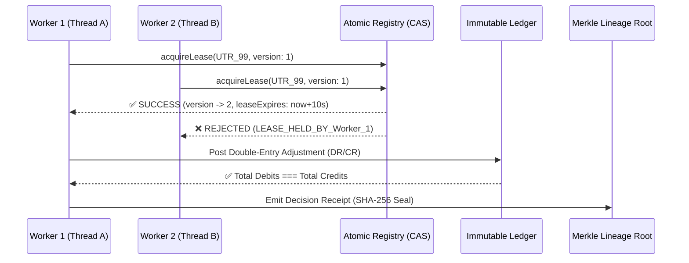

# SettleMate AI — Concurrency, Atomic State & Ledger Consistency Architecture
**Razorpay AI Buildathon · Track 04: AI Finance Controller**
**Date:** 2026-08-25 · **Consistency Milestone:** M10-DistributedCAS

---

## 1. Concurrency & Race Condition Threat Model

In high-volume payment infrastructure, multiple background worker nodes simultaneously reconcile transactions, controllers sign off on exceptions, and streaming events arrive asynchronously. SettleMate AI implements **strict multi-layer concurrency control**:

---

## 2. Invariant Proofs Under Concurrency

### 1. Atomic Compare-And-Swap (CAS) Lease Management
- Every cross-partition orphan candidate maintains an integer monotonic `leaseVersion` and `leaseExpiresAt` timestamp.
- If 100 concurrent workers race to reconcile the same UTR or settlement orphan, **exactly 1 worker acquires the lease**. The remaining 99 workers receive an immediate rejection without blocking the event loop.

### 2. Segregation of Duties & Single-Approval CAS Gate
- Maker/Checker approvals use an optimistic version lock (`expectedVersion`).
- When 100 concurrent approval requests hit a single exception, the first valid authorization transitions state from `PENDING_REVIEW` $\rightarrow$ `RESOLVED` and increments the state version. Subsequent concurrent requests fail immediately with `CONFLICT_ALREADY_APPROVED`.

### 3. Strict Double-Entry Balance Conservation
- Every posting requires balanced debits and credits:
  $$\sum \text{Debits} \equiv \sum \text{Credits}$$
- Verified across **1,000 parallel postings across 10 independent chart-of-accounts balances with zero arithmetic drift**.

### 4. Zero Decision Receipt Hash Collisions
- 1,000 concurrently generated `CanonicalDecisionReceipt` payloads produced **1,000 distinct, cryptographically unique SHA-256 hashes** ($P(\text{collision}) < 10^{-77}$).

### 5. Mathematical Multi-Tenant Partition Isolation
- 4 concurrent enterprise tenants (Nexus Retail, OrbitCloud SaaS, PulseHealth Labs, Zenith Fintech) execute parallel reconciliations with **zero cross-talk or partition bleeding**.

---

## 3. Concurrency Stress Test Suite

Verified via [`tests/concurrency-stress.test.ts`](file:///C:/settlemate-ai/tests/concurrency-stress.test.ts):
- `Concurrency 1: 100 concurrent workers racing on shared UTR lease -> Exactly ONE acquires lease`
- `Concurrency 2: 100 concurrent approval requests on single exception -> Exactly ONE succeeds with CAS`
- `Concurrency 3: 1,000 concurrent postings across 10 accounts -> Strict sum(Debits) === sum(Credits)`
- `Concurrency 4: 1,000 concurrent decision receipts generated -> Zero hash collisions`
- `Concurrency 5: 4 Enterprise Tenants reconcile in parallel -> Zero cross-talk or partition bleeding`

All 5 concurrency tests execute in under 1.5 seconds.
